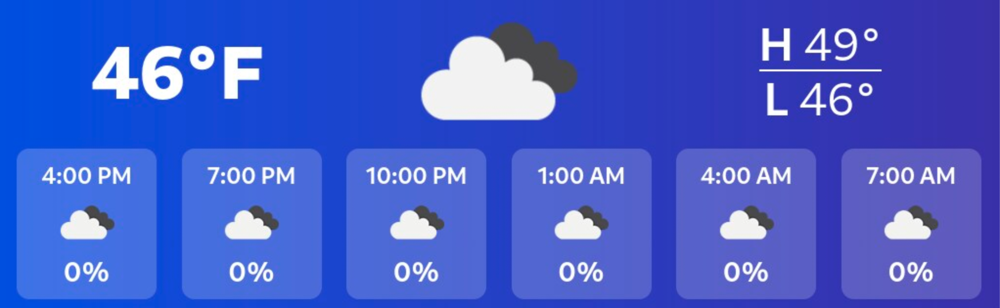

# Overview
A Raspberry Pi home media hub for Sonos control, Spotify now-playing display, local weather at a glance, and more.

**Now-playing example:**


**Weather dashboard example:**


This project contains a set of locally hosted apps and services with features including:
- Sonos and Spotify now-playing LCD: displays artist, track title and album artwork with a vibrant, dynamic background color chosen from the album artwork
- Local weather dashboard: displays local forecast during a scheduled window, via free OpenWeather API
- Custom local network endpoints: add the currently-playing song to a Spotify playlist which can be set up as a single-click iOS shortcut, and includes de-dupe to prevent the same song from being added multiple times
- Full Sonos controls: group/ungroup rooms, adjust volume, play/pause/skip tracks, etc. via iOS shortcuts, no longer need to use the clunky Sonos app
- Sonos presets: combine multiple actions (group rooms, set volume, add playlist to queue, play in shuffle, etc) all into a single iOS shortcut
- Auto display sleep/wake behavior: based on playback and schedule

## Hardware Requirements

* Raspberry Pi - I used a [Raspberry Pi 4](https://www.amazon.com/dp/B07TC2BK1X?th=1) and a separate [power adapter](https://www.amazon.com/dp/B07VFDYNL4)
* LCD Screen - I used a [7.9" Waveshare](https://www.waveshare.com/7.9inch-hdmi-lcd.htm) / [Amazon](https://www.amazon.com/dp/B087CNJYB4)
* [Micro SD Card](https://www.amazon.com/dp/B08J4HJ98L?th=1)

---

## First-Time Setup

From your Pi:

```bash
git clone https://github.com/aspain/spainify.git
cd spainify
```

The now-playing display does not require Spotify auth. Spotify credentials are only needed if you enable `add-current`.

### 1. Run the setup wizard

From the repo root:

```bash
cd ~/spainify
./setup.sh
```

What `setup.sh` does:

1. Prompts you for each service/app (`custom` mode by default)
2. Applies dependency guardrails (for example, `spotify_display` requires `sonify-serve` + `sonos-http-api`)
3. Attempts Sonos room discovery (numbered selection) when Sonos API is reachable; otherwise falls back to manual room entry
4. Writes local config/env files for this Pi:
   - `.spainify-device.env`
   - `apps/add-current/.env` (if enabled)
   - `apps/spotify-display/.env` (if enabled)
   - `apps/weather-dashboard/.env` (if enabled)
   - `apps/sonify/.env.local` (if enabled)
5. Runs `./scripts/redeploy.sh` (unless you skip at the final prompt)

Re-running `./setup.sh` is safe and is the intended way to change this device's enabled services later.

### 2. Optional: one-time Spotify auth (to get refresh token)

If you enabled `add-current` and still need a refresh token:

```bash
cd ~/spainify/apps/add-current
node auth.js
```

Then in a browser:

1. Open `http://<pi-ip>:8888/login`
2. Approve Spotify permissions
3. Copy the `refresh_token` shown
4. Re-run `./setup.sh` and paste the token when prompted

---

**Apps/services included:**

* **Sonos HTTP API** (`apps/sonos-http-api`) - Forked from [node-sonos-http-api](https://github.com/jishi/node-sonos-http-api) with a small local `/album-art` proxy addition
* **Add Current Track to Spotify microservice** (`apps/add-current`)
* **Spotify Display Controller** (`apps/spotify-display`)
* **Weather Dashboard (React)** (`apps/weather-dashboard`)
* **Sonify UI (Vue)** (`apps/sonify`) This is a modified fork of [Nowify](https://github.com/jonashcroft/Nowify)
* **Systemd service definitions** (`systemd/`)
* **Deployment script** (`scripts/redeploy.sh`) - Script to run to avoid all doubt for which services to restart upon making changes

**Ports/URLs (defaults):**
- Sonify UI: `http://localhost:5000`
- Weather dashboard: `http://localhost:3000`
- Sonos HTTP API: `http://localhost:5005`
- Add-current microservice: `http://localhost:3030`
- Spotify auth helper (only for add-to-playlist; now-playing needs no auth): `http://<pi-ip>:8888/login`

---

## Project Structure

```text
apps/
  add-current/
  sonos-http-api/
  spotify-display/
  weather-dashboard/
  sonify/
scripts/
  redeploy.sh
systemd/
setup.sh
```

---

## Environment Variables

Each app that needs secrets uses a local `.env` file which is **not** committed to git.

### `.spainify-device.env`

Generated by `./setup.sh`; this is the per-device service profile used by `./scripts/redeploy.sh`.

It stores service toggles such as:

```ini
ENABLE_ADD_CURRENT=0
ENABLE_SPOTIFY_DISPLAY=1
ENABLE_WEATHER_DASHBOARD=0
ENABLE_SONOS_HTTP_API=1
ENABLE_SONIFY_SERVE=1
```

Disabled services are automatically stopped/disabled during redeploy on that device.

### `apps/add-current/.env`

Used by the "add current track to Spotify" microservice.

Template: `apps/add-current/.env.example`

```ini
SPOTIFY_CLIENT_ID=your_spotify_client_id
SPOTIFY_CLIENT_SECRET=your_spotify_client_secret
SPOTIFY_REFRESH_TOKEN=your_refresh_token
SPOTIFY_PLAYLIST_ID=your_playlist_id

# Sonos HTTP API base (usually localhost:5005)
SONOS_HTTP_BASE=http://127.0.0.1:5005

# Optional: preferred Sonos room if multiple zones are playing
PREFERRED_ROOM=

# Service port
PORT=3030

# How many of the most recently added songs will be checked for duplicates
DE_DUPE_WINDOW=750
```

---

### `apps/weather-dashboard/.env`

Used by the React weather dashboard.

Template: `apps/weather-dashboard/.env.example`

```ini
REACT_APP_OPENWEATHER_API_KEY=your_openweather_api_key
REACT_APP_CITY=YourCityName
```

### `apps/spotify-display`

Used by the Raspberry Pi process that switches between the Sonify and weather displays.

Template: `apps/spotify-display/.env.example`

```ini
# Optional: override the Sonos room to monitor for playback
SONOS_ROOM=Living Room

# Optional: hide cursor only while Sonify/Weather is displayed
HIDE_CURSOR_WHILE_DISPLAYING=1

# Optional: idle seconds before cursor is hidden
HIDE_CURSOR_IDLE_SECONDS=0.1
```

The weather window (7 AM to 9 AM) follows the Pi's local system timezone.

For cursor hiding support, install once on the Pi:

```bash
sudo apt install unclutter
```

### `apps/sonify`

* No Spotify credentials required directly in Sonify.
* Optional Spotify metadata enrichment (full track title, full artist list, canonical album art):
  * Uses the local `add-current` service at `http://localhost:3030`
  * Requires valid Spotify credentials in `apps/add-current/.env`
  * Optional override in `apps/sonify/.env.local`: `VUE_APP_ADD_CURRENT_BASE=http://localhost:3030`
* Optional room override:
  * Copy `apps/sonify/.env.local.example` to `apps/sonify/.env.local`
  * Set `VUE_APP_SONOS_ROOM` (preferred) or `VITE_SONOS_ROOM` (legacy fallback)
  * Default remains `"Living Room"` if unset.

---

## Redeploy / Update Workflow

For future updates you normally only need:

```bash
cd ~/spainify
git pull
./scripts/redeploy.sh
```

For multi-Pi setups, run those commands on each Pi. Each Pi can share the same repo but keep different local service choices through its own `.spainify-device.env`.

The `redeploy.sh` script:

* Reads `.spainify-device.env` when present and reconciles service state on this Pi
* Installs dependencies only for enabled services
* Builds frontend assets only for enabled UI apps
* Creates/updates `backend/venv` and installs `apps/spotify-display/requirements.txt` only when `spotify_display` is enabled
* Renders systemd unit templates in `systemd/` for your current username/repo path, then installs them into `/etc/systemd/system/`
* Enables + restarts enabled services, and stops + disables disabled services

If you change only frontend code or Python logic, re-running `./scripts/redeploy.sh` is usually enough.

---

## Systemd Services

Relevant units (installed into `/etc/systemd/system`):

* `add-current.service` — Spotify playlist microservice
* `sonos-http-api.service` — Sonos HTTP API backend
* `sonify-serve.service` — Vue UI (Now Playing)
* `spotify_display.service` — Python controller & Chromium display
* `weather-dashboard.service` — Weather React app

Common commands:

```bash
# Check status
systemctl status add-current.service

# Restart one service
sudo systemctl restart spotify_display.service

# Restart everything
sudo systemctl restart \
  add-current.service \
  sonos-http-api.service \
  sonify-serve.service \
  spotify_display.service \
  weather-dashboard.service
```

---

## Development Notes

You can also run pieces manually for debugging.

```bash
# Add-current microservice
cd apps/add-current
npm start

# Sonos HTTP API
cd apps/sonos-http-api
npm start

# Weather dashboard (dev mode)
cd apps/weather-dashboard
npm start

# Sonify UI (dev mode)
cd apps/sonify
npm run serve

# Spotify display controller (standalone)
cd apps/spotify-display
python3 spotify_display_control.py
```

When running in dev mode, remember systemd services may already be bound to the same ports. Stop them first if needed:

```bash
sudo systemctl stop add-current.service sonify-serve.service weather-dashboard.service
```

---

## Updating Secrets Safely

* All `.env` files are ignored by git via the root `.gitignore`.
* Never commit actual client IDs, secrets, or tokens.
* If you rotate keys, just update your local `.env` files and re-run:

```bash
./scripts/redeploy.sh
```

That will pick up changes and restart the services.

---

## Recognition

Huge shoutout to the authors of [Nowify](https://github.com/jonashcroft/Nowify) and [node-sonos-http-api](https://github.com/jishi/node-sonos-http-api) from which I drew inspiration, built upon, and utilized features of.
