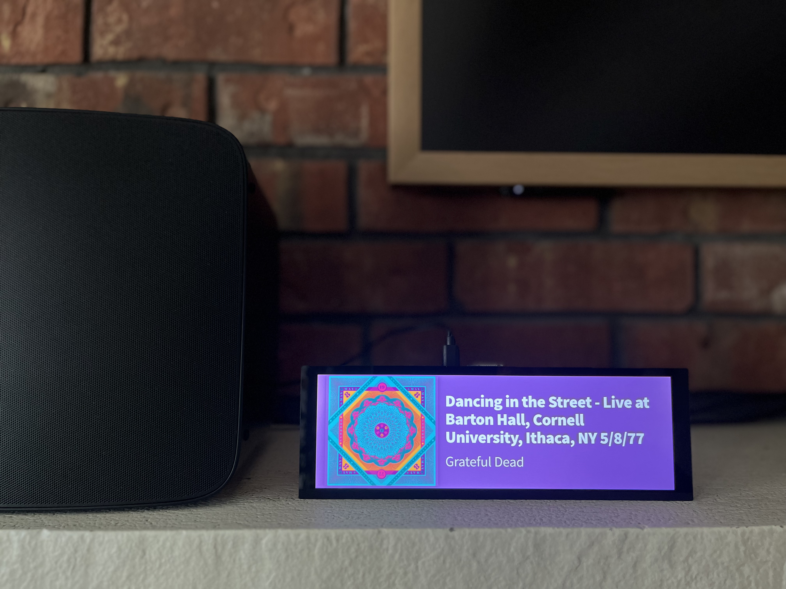
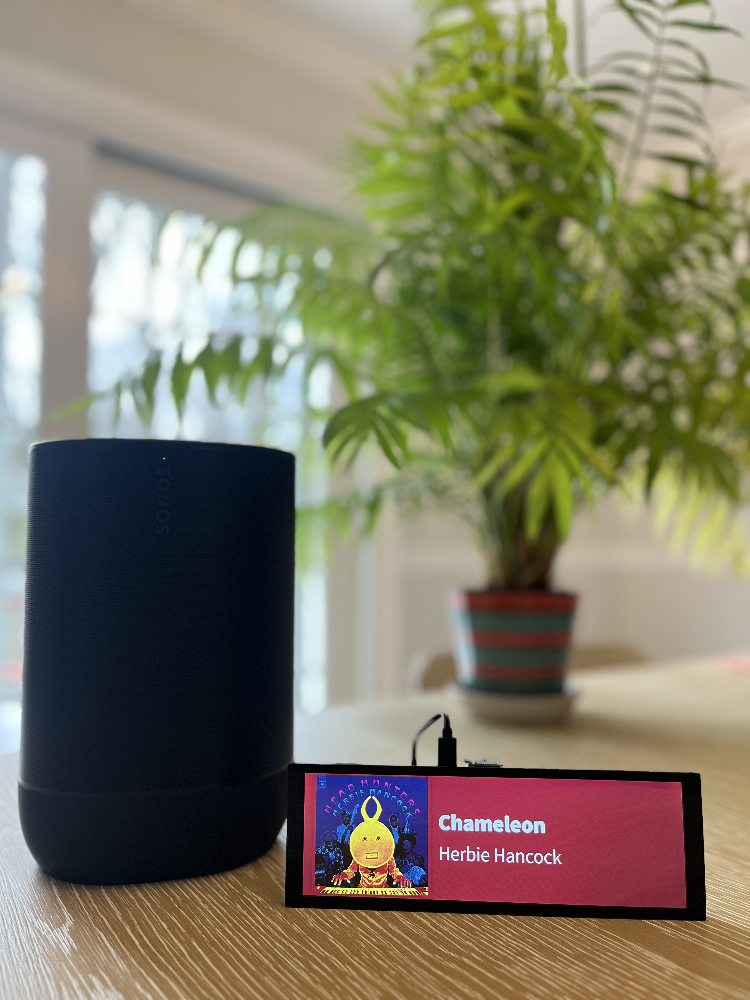
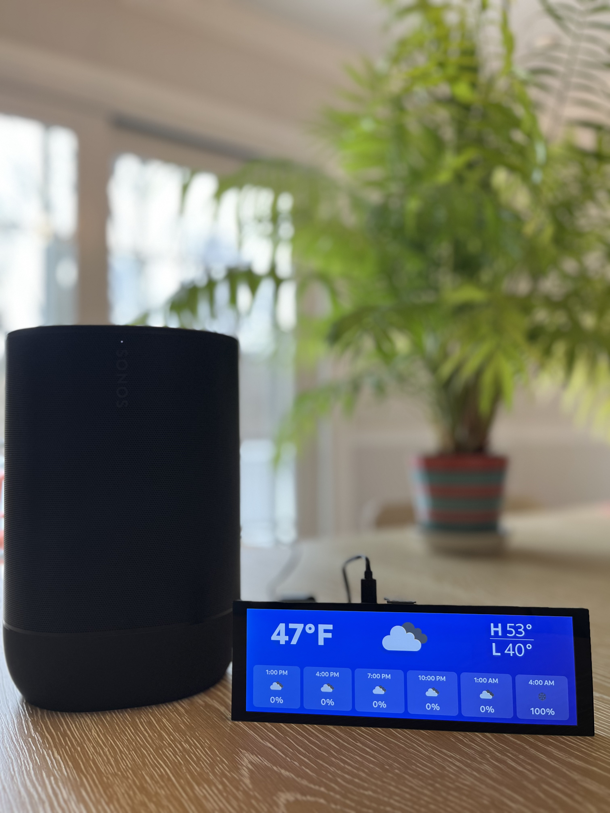

# Overview
A Raspberry Pi home media hub for Spotify/Sonos now-playing display, Sonos controls, local weather at a glance, and more.

**Examples:**
<p align="center">
  
  
  
</p>

This project contains a set of locally hosted apps and services with features including:
- Sonos and Spotify now-playing LCD: displays artist, track title and album artwork with a vibrant, dynamic background color chosen from the album artwork
- Local weather dashboard: displays local forecast during a scheduled window, via free OpenWeather API
- Custom local network endpoints: add the currently-playing song to a Spotify playlist which can be set up as a single-click iOS shortcut, and includes de-dupe to prevent the same song from being added multiple times
- Full Sonos controls: group/ungroup rooms, adjust volume, play/pause/skip tracks, etc. via iOS shortcuts, no longer need to use the clunky Sonos app
- Sonos presets: combine multiple actions (group rooms, set volume, add playlist to queue, play in shuffle, etc) all into a single iOS shortcut
- Auto display sleep/wake behavior: based on playback and schedule

## Hardware Requirements

* Raspberry Pi - I used a [Raspberry Pi 4](https://www.amazon.com/dp/B07TC2BK1X?th=1) and a separate [power adapter](https://www.amazon.com/dp/B07VFDYNL4)
* LCD Screen - I used a [7.9" Waveshare](https://www.waveshare.com/7.9inch-hdmi-lcd.htm) / [Amazon](https://www.amazon.com/dp/B087CNJYB4)
* [Micro SD Card](https://www.amazon.com/dp/B08J4HJ98L?th=1)

---

## First-Time Setup

Use this from your laptop/desktop terminal (recommended):

```bash
git clone https://github.com/aspain/spainify.git
cd spainify
./scripts/setup-remote.sh <pi-user>@<pi-ip> --fresh
```

This is the main setup command. It connects to the Pi over SSH, runs the setup wizard, and runs redeploy.
If `media-actions-api` is enabled, it also handles Spotify auth through the tunneled login URL automatically.

Now-playing works without Spotify credentials.
Spotify credentials are only required for add-to-playlist and optional metadata enrichment (via `media-actions-api`).

Before running setup, gather API credentials:

1. OpenWeather (weather-dashboard)
   - Create/sign in and generate an API key at https://home.openweathermap.org/api_keys
   - Paste that value into the `OpenWeather API key` setup prompt.
   - Setup then guides location input with three modes:
     - US mode: enter city + 2-letter state code (saved as `City,ST,US`)
     - International mode: enter city + 2-letter country code (saved as `City,CC`)
     - Advanced mode: enter a raw OpenWeather location query

2. Spotify (media-actions-api)
   - Create/sign in to Spotify Developer and open the dashboard: https://developer.spotify.com/dashboard
   - Create an app and add both redirect URIs:
     - `http://127.0.0.1:8888/callback`
     - `http://<pi-ip-address>:8888/callback`
   - Copy `Client ID` and `Client Secret` into setup prompts.

Optional: run setup directly on the Pi (for local desktop use):

```bash
cd ~/spainify
./setup.sh
```

`setup.sh` is the core setup wizard used by `setup-remote.sh`.

To change service choices later, just re-run setup:

```bash
./scripts/setup-remote.sh <pi-user>@<pi-ip>
```

---

## Apps and Services

- `media-actions-api.service` — playlist add + metadata + Sonos grouping API
- `display-controller.service` — Python display controller (power, browser, mode switching)
- `sonify-ui.service` — now-playing web UI host
- `sonos-http-api.service` — Sonos HTTP API backend (includes local `/album-art` proxy)
- `weather-dashboard.service` — weather web UI host
- Source app directories live under `apps/` (for example `apps/media-actions-api`, `apps/display-controller`, `apps/sonify-ui`)
- `systemd/` — service unit templates
- `scripts/redeploy.sh` — deploy/restart enabled services for this Pi

## Default Ports

- Sonify UI: `http://localhost:5000`
- Weather dashboard: `http://localhost:3000`
- Sonos HTTP API: `http://localhost:5005`
- Media actions API: `http://localhost:3030`
- Spotify auth helper (setup flow only): `http://127.0.0.1:8888/login` (via tunnel)

## Device Configuration

Setup writes all required config files for the device. In normal usage, you should not need to create or edit these manually.

- `.spainify-device.env` — per-device service enablement profile used by `scripts/redeploy.sh`
- `media-actions-api` config file: `apps/media-actions-api/.env` (Spotify/API settings, if enabled)
- `display-controller` config file: `apps/display-controller/.env` (room/cursor settings, if enabled)
- `weather-dashboard` config file: `apps/weather-dashboard/.env` (API key, city, display start/end time)
- `sonify-ui` config file: `apps/sonify-ui/.env.local` (room + optional metadata endpoint, if enabled)

To change settings, re-run setup instead of editing files by hand:

```bash
./scripts/setup-remote.sh <pi-user>@<pi-ip>
```

## Redeploy / Update Workflow

For normal code updates on a configured Pi:

```bash
ssh <pi-user>@<pi-ip> 'cd ~/spainify && git pull --ff-only && ./scripts/redeploy.sh'
```

For service or room changes, run setup again:

```bash
cd /path/to/spainify
./scripts/setup-remote.sh <pi-user>@<pi-ip>
```

If setup already exists, the wizard asks whether to run full setup or add/modify one specific item.

Targeted mode supports:
- `media-actions-api` (playlist + track-details + grouping API)
- `weather-dashboard`
- `Now-playing Sonos zone`

In targeted mode, setup redeploys only the required service scope instead of running a full redeploy.

For multi-Pi setups, run the same update commands on each Pi. Each Pi keeps its own local `.spainify-device.env`.

## Service Commands

```bash
# Status of all core services
for s in media-actions-api sonos-http-api sonify-ui display-controller weather-dashboard; do
  printf "%-20s active=%-8s enabled=%s\n" "$s" "$(systemctl is-active "$s".service)" "$(systemctl is-enabled "$s".service)"
done

# Restart one service
sudo systemctl restart display-controller.service

# Restart all services
sudo systemctl restart media-actions-api.service sonos-http-api.service sonify-ui.service display-controller.service weather-dashboard.service
```

## Security Notes

- `.env` files are git-ignored.
- Never commit Spotify/OpenWeather secrets or tokens.
- If you rotate credentials, re-run setup (or update local `.env` files) and then run:

```bash
./scripts/redeploy.sh
```

---

## Recognition

Huge shoutout to the authors of [Nowify](https://github.com/jonashcroft/Nowify) and [node-sonos-http-api](https://github.com/jishi/node-sonos-http-api) from which I drew inspiration, built upon, and utilized features of.
